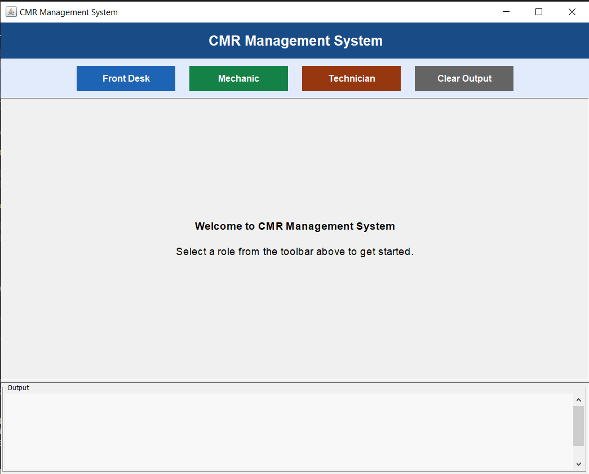
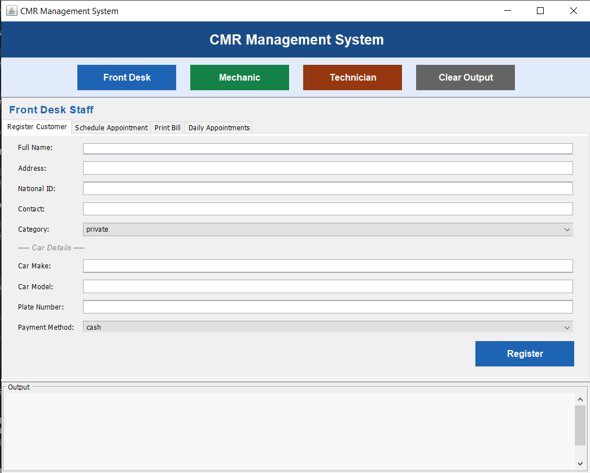
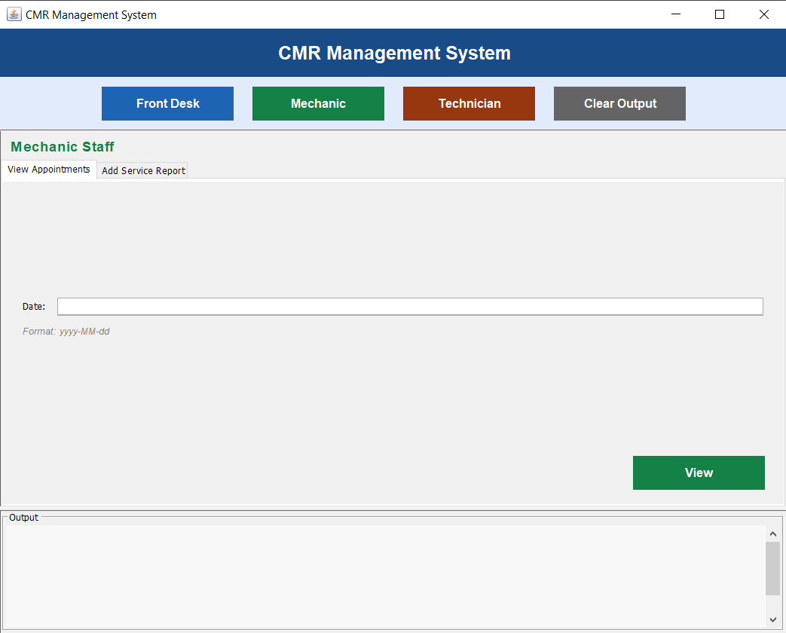
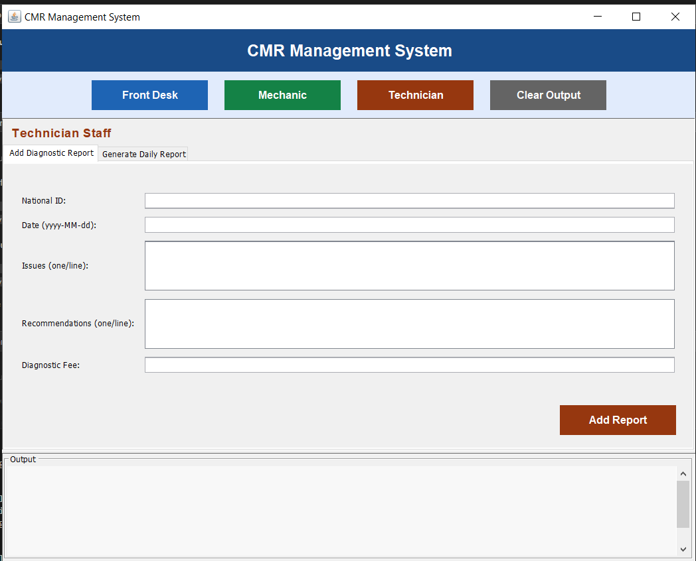

# 🚗 CMR Management System (Car Maintenance & Repair)

A robust, enterprise-grade Car Maintenance and Repair (CMR) Management System developed in Java. This system leverages modern software design patterns and a Java Swing GUI to provide a seamless experience for managing customer records, scheduling appointments, generating reports, and handling billing.

---

## ✨ Key Features

- **👤 Multi-Role Dashboard**: Specialized interfaces for Front Desk Staff, Mechanics, and Technicians.
- **📅 Appointment Scheduling**: Efficiently schedule and manage vehicle maintenance slots.
- **🛠️ Service & Diagnostic Reports**: Detailed tracking of repairs, parts used, and technical recommendations.
- **💳 Integrated Billing**: Automated bill generation with support for Cash and Credit Card payments.
- **📊 Daily Reporting**: Generate comprehensive summaries of serviced vehicles and financial transactions.
- **🧩 Advanced Design Patterns**: Implements **Facade**, **Factory**, and **Iterator** patterns for high maintainability.

---

## 📸 System Walkthrough

The system provides different perspectives based on the staff role, ensuring a streamlined workflow for every team member.

| 🏠 Main Dashboard | 📋 Front Desk View |
| :---: | :---: |
|  |  |
| **🔧 Mechanic View** | **💻 Tech View** |
|  |  |

---

## 📂 Project Structure

- **`CMRGui.java`**: The primary Graphical User Interface built with Swing.
- **`CMRManagementSystem.java`**: The central **Facade** coordinating all backend operations.
- **`CustomerFactory.java`**: Implements the **Factory Pattern** for dynamic customer creation (Private, Fleet, Staff).
- **`AppointmentIterator.java`**: Uses the **Iterator Pattern** for efficient traversal of schedules.
- **`PaymentMethod.java`**: Strategy-based implementation for various payment types.

---

## 🚀 Getting Started

### Prerequisites
- **JDK 8** or higher installed.
- A terminal or a Java-capable IDE.

### Installation & Execution
1. **Clone the repository**:
   ```bash
   git clone https://github.com/owntarawneh/CMRManagementSystem.git
   cd CMRManagementSystem
   ```

2. **Compile the project**:
   ```bash
   javac *.java
   ```

3. **Run the GUI Application**:
   ```bash
   java CMRGui
   ```

---

## 🛠️ Technical Stack
- **Language**: Java
- **UI Framework**: Java Swing
- **Architecture**: Facade, Factory, Iterator, Strategy Patterns
- **Logging**: Automatic `.txt` report generation

---
*Developed with ❤️ for Advanced Software Engineering.*
